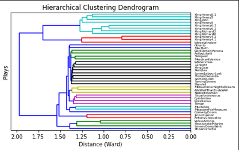

# Lexical Sentiment Analysis and Similarity Clustering

This repo contains example scripts for unsupervised sentiment and similarity analsyses. The lexical sentiment analysis leverages the NRC lexicon and runs on the scripts of Star Wars movies 4-6 determining the sentiment of Darth Vader. The results can be found below: 

```
Star Wars 4:
-----------------------
Sentiment      Score
-----------------------
anger          21   
anticipation   19   
disgust        6    
fear           20   
joy            5    
negative       27   
positive       23   
sadness        8    
surprise       4    
trust          17   
-----------------------


Star Wars 5:
-----------------------
Sentiment      Score
-----------------------
anger          9    
anticipation   31   
disgust        6    
fear           15   
joy            20   
negative       21   
positive       59   
sadness        11   
surprise       13   
trust          38   
-----------------------


Star Wars 6:
-----------------------
Sentiment      Score
-----------------------
anger          10   
anticipation   11   
disgust        5    
fear           13   
joy            9    
negative       19   
positive       24   
sadness        14   
surprise       8    
trust          14   
-----------------------
```


The clustering analysis analyses the similarty of Shakespeare playes to create a dendogram as seen below.





